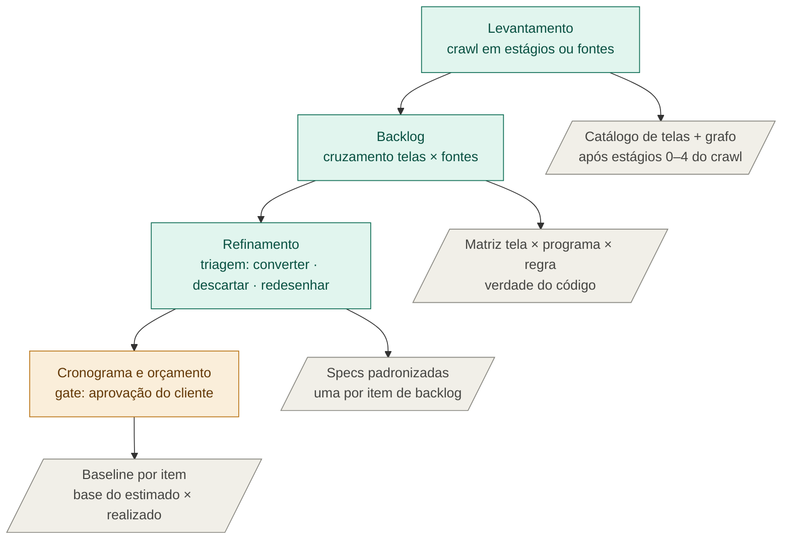
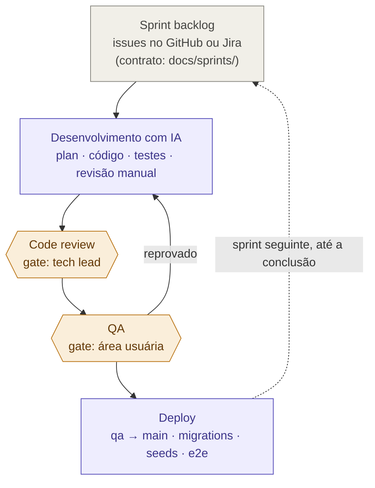
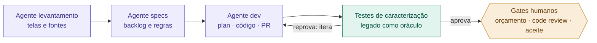

# convert.ia — diagramas do framework

Três visões do processo de conversão de sistemas apoiado em IA: a fase de análise com seus contratos de artefato, o ciclo de execução com os gates humanos, e o modo loop (visão de maturidade).

> **Renderização:** GitHub, GitLab e a maioria dos editores Markdown renderizam Mermaid nativamente em blocos ` ```mermaid `. No Confluence é necessário um app de Mermaid (ex.: "Mermaid Diagrams for Confluence") ou colar a imagem exportada de https://mermaid.live. Se as cores dos `classDef` conflitarem com o tema, basta remover as linhas de estilo — a semântica está nos rótulos.

**Legenda de cores:** teal = fase de análise · cinza = artefato (contrato) / gestão · âmbar = gate humano · roxo = execução / agente.

## 1. Fase de análise e contratos de artefato

Cada fase produz um artefato padronizado que alimenta a fase seguinte. Enquanto esses artefatos forem prosa livre, o loop não fecha; estruturados, viram insumo de agentes. O crawl de interface sobe em estágios até o catálogo — ver [`../levantamento/estrategia-crawl.md`](../levantamento/estrategia-crawl.md).



## 2. Ciclo de execução (roda a cada sprint)

Os gates humanos permanecem mesmo no modo loop; tudo entre eles é candidato a automação. Item reprovado no QA retorna ao desenvolvimento.



## 3. Modo loop (visão de maturidade)

As fases viram agentes encadeados pelos contratos de artefato. O oráculo de caracterização — a suíte gerada a partir do grafo de navegação do levantamento, rodando os mesmos cenários contra o legado e o sistema novo (skill: [`characterization-tester`](../../.claude/skills/characterization-tester/SKILL.md)) — fecha o ciclo de validação automaticamente. Os humanos saem da execução e ficam nos gates.



## Leitura em conjunto

O diagrama 1 é o que existe hoje formalizado com contratos; o 2 é o motor que roda a cada sprint; o 3 é para onde o framework caminha. O oráculo do diagrama 3 nasce do primeiro artefato do diagrama 1 (o grafo do crawler virando suíte de testes), e os gates do 3 são as mesmas caixas âmbar dos anteriores — o loop não exige inventar nada novo, apenas reorganizar o que já está no processo.
