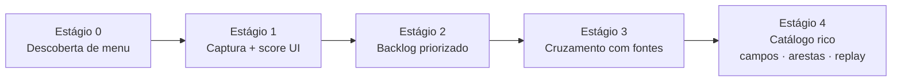

# convert.ia — estratégia de crawl de telas

Como chegar ao [catálogo de telas](./schemas/catalogo-telas.schema.json) quando o legado tem interface navegável. Validado em piloto com WebPanels GeneXus (menu lateral + menubar); o padrão se adapta a outros shells, mas a sequência de estágios não.

> **Ambiente:** nunca produção. Homologação ou snapshot — o crawler clica de verdade.

## Visão em estágios

O contrato rico do catálogo (campos, ações, arestas, `casos_replay`, design system seco) é o **alvo**. Em sistemas densos, ninguém chega lá no primeiro passe. O pipeline operacional é uma escada:



| Estágio | Pergunta que responde | Artefato típico |
|---|---|---|
| 0 | Quais telas o menu alcança? | lista de alvos (módulo → path → URL) |
| 1 | Quão densa é cada tela na UI? | relatório de crawl + screenshots |
| 2 | O que converter primeiro? | backlog P1/P2/P3 (ou equivalente) |
| 3 | Qual objeto do legado serve essa tela? | inventário cruzado / árvores de dependência |
| 4 | O que a tela faz e como o legado responde? | catálogo conforme o schema + `casos_replay` |

Os estágios 0–3 alimentam a [matriz de cruzamento](./README.md). O estágio 4 preenche o schema do catálogo e viabiliza caracterização. Skills e agentes **não inventam** campos nem saídas de replay nos estágios 0–3.

## Estágio 0 — Descoberta de menu

Objetivo: enumerar folhas navegáveis a partir da estrutura de menu do legado, sem entrar em cada formulário ainda.

Padrão observado (GeneXus Web):

1. Autenticar na homolog; tratar sessão expirada.
2. Listar módulos do menu principal (excluir portais externos, logout, links mortos).
3. Por módulo: abrir top-level → hover/expandir → coletar folhas (href `.aspx` / evento de submit, ou equivalente no stack).
4. Submenus aninhados: segundo nível só quando o item tem popup/filho.
5. Deduplicar por URL (ou rota canônica).
6. Filtrar ruído do shell (widgets laterais, mailto, itens fora da área do menu) — isso costuma exigir scripts de debug no DOM antes do crawl “oficial”.

Saída mínima por alvo: `modulo`, `menu_path`, `titulo_link`, `url` (ou rota).

## Estágio 1 — Captura e complexidade de UI

Para cada alvo (e home do módulo, se fizer sentido):

1. Navegar pelo mesmo caminho de menu (não só `goto` na URL — muitos legados dependem de estado de sessão/menu).
2. Screenshot full-page.
3. Contar controles **visíveis**: inputs, selects, textareas, botões, tabelas/grids, links, labels/blocos de texto.
4. Calcular score ponderado e faixa (baixa → muito alta). Os pesos são do projeto; o importante é ser estável e auditável no relatório.

Saída: relatório (`json`/`csv`/`md`) com uma linha por tela visitada + pasta de screenshots. Isso **não** é ainda o catálogo do schema — é o insumo bruto.

Heurística de score (exemplo de piloto; recalibrar por stack):

- inputs/selects × 2, textareas × 3, tabelas × 4, grids × 6, botões/links × 1, labels/textos com peso baixo
- faixas tipicamente: média ≥ 45, alta ≥ 80, muito alta ≥ 120 — em shells com menu denso quase tudo cai em “muito alta”; use o score absoluto + negócio no estágio 2, não só o rótulo

## Estágio 2 — Priorização

Cruzar densidade de UI com impacto de negócio:

- módulos de alto impacto operacional (ex.: matrícula, secretaria, RH)
- palavras-chave de fluxo crítico vs. cadastros auxiliares / logs / notícias
- score alto + fluxo crítico → P1; módulo estratégico com complexidade média → P2; parametrização auxiliar → P3

Atribuir ids estáveis (`TEL-…` ou `SGE-…`) — esses ids entram depois na matriz e no frontmatter das specs.

Classificar tipo de tela por heurística (grid+formulário, grid intensivo, formulário intensivo, navegação densa, mista) ajuda o sizing no [cronograma](../cronograma/README.md), mas não substitui a complexidade registrada na spec após refinamento.

## Estágio 3 — Cruzamento com fontes

Para cada item do backlog priorizado:

1. Mapear URL/rota → objeto de UI no inventário de fontes (`programa_provavel` / WebPanel / controller). Confiança: exato, normalizado, ambíguo, não encontrado.
2. Expandir dependências a partir do inventário (chamadas, procedures, transactions, tabelas) — fecho transitivo com profundidade limitada.
3. Enriquecer com sinais do fonte quando o índice estiver incompleto (ex.: parse de `.Call` / `Udp` / `For Each` em XML exportado).
4. Derivar tier de conversão e risco (PDF, SMS, muitas transactions, auth/sessão) — isso calibra estimativa; a verdade de regras continua sendo o fonte.

Saída: linhas da matriz tela↔objeto + órfãos (tela sem objeto / objeto sem tela). Árvores de dependência por item são opcionais, mas aceleram deparo e checklist de implementação.

## Estágio 4 — Catálogo rico (ainda o alvo)

Só aqui o registro passa a obedecer o [schema do catálogo](./schemas/catalogo-telas.schema.json):

- `campos`, `acoes`, `arestas` observados na UI (e confirmados no fonte quando houver divergência — o fonte vence)
- `casos_replay` capturados **no legado** (entrada → `saida_legado`); nunca inventados
- `design_system.tokens` / componentes recorrentes, se o passe de DS seco estiver no escopo do projeto

Até o estágio 4 existir para um item, o [spec-generator](../../.claude/skills/spec-generator/SKILL.md) não tem `casos_replay` confiáveis — sinalize o buraco em vez de preencher. A jusante, é o [characterization-tester](../../.claude/skills/characterization-tester/SKILL.md) que consome esses casos para validar paridade do sistema novo.

## O que o crawl de menu deliberadamente não faz

- Não submete formulários de escrita no estágio 0–1 (exceto login). Replay de escrita é estágio 4, com cuidado com dados de homolog.
- Não substitui inventário de fontes: jobs, batches e telas sem menu continuam órfãos a investigar.
- Não decide triagem `descartar` / `redesenhar` — gate humano (seção 4 da spec).
- Não gera migration nem altera schema compartilhado.

## Relação com os contratos

```
estágios 0–1  →  evidência visual + densidade
estágio 2     →  ordem do backlog
estágio 3     →  matriz + inventário consumido
estágio 4     →  catalogo-telas.schema.json (completo)
```

O skill de processo correspondente: [`skills/screen-crawler/`](../../.claude/skills/screen-crawler/SKILL.md).
