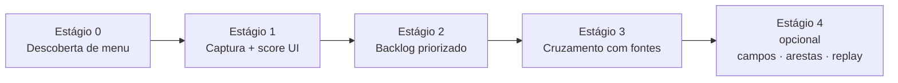

# convert.ia — estratégia de crawl de telas

Como chegar ao [catálogo de telas](./schemas/catalogo-telas.schema.json) quando o legado tem interface navegável. Validado em piloto com WebPanels GeneXus (menu lateral + menubar); o padrão se adapta a outros shells, mas a sequência de estágios não.

> **Ambiente:** nunca produção. Homologação ou snapshot. Antes de qualquer escrita: identidade de ambiente na UI (rodapé/banner/build), não só hostname — ver princípio 6 do `CLAUDE.md`.

## Visão em estágios

O pipeline operacional sobe até a matriz e o backlog. O catálogo “rico” (campos, arestas) é desejável; **replay ao vivo (`casos_replay`) é opcional/exceção**, não o caminho padrão de testes (ver princípio 4 do `CLAUDE.md`).



| Estágio | Pergunta que responde | Artefato típico |
|---|---|---|
| 0 | Quais telas o menu alcança? | lista de alvos (módulo → path → URL) |
| 1 | Quão densa é cada tela na UI? | relatório de crawl + screenshots |
| 2 | O que converter primeiro? | backlog P1/P2/P3 (ou equivalente) |
| 3 | Qual objeto do legado serve essa tela? | inventário cruzado / árvores + matriz |
| 4 | (opcional) Detalhe de UI / replay ao vivo | campos/arestas; `casos_replay` só sob pedido |

Os estágios 0–3 alimentam a [matriz de cruzamento](./README.md). Skills e agentes **não inventam** campos nem `saida_legado` nos estágios 0–3.

## Estágio 0 — Descoberta de menu

Objetivo: enumerar folhas navegáveis a partir da estrutura de menu do legado, sem entrar em cada formulário ainda.

**Gate de ambiente (antes do login com mutação):** ler na página evidência de homolog/snapshot (rodapé, banner, build). Se houver rótulo de produção ou nenhuma marca de não-produção → parar e alertar o humano.

Padrão observado (GeneXus Web):

1. Autenticar na homolog; tratar sessão expirada.
2. Listar módulos do menu principal (excluir portais externos, logout, links mortos).
3. Por módulo: abrir top-level → hover/expandir → coletar folhas (href `.aspx` / evento de submit, ou equivalente no stack).
4. Submenus aninhados: segundo nível só quando o item tem popup/filho.
5. Deduplicar por URL (ou rota canônica).
6. Filtrar ruído do shell (widgets laterais, mailto, itens fora da área do menu) — isso costuma exigir scripts de debug no DOM antes do crawl “oficial”.

Saída mínima por alvo: `modulo`, `menu_path`, `titulo_link`, `url` (ou rota).

Legado GeneXus: alinhar KB/branch ao ambiente — [`notas-genexus.md`](./notas-genexus.md).

## Estágio 1 — Captura e complexidade de UI

Para cada alvo (e home do módulo, se fizer sentido):

1. Navegar pelo mesmo caminho de menu (não só `goto` na URL — muitos legados dependem de estado de sessão/menu; URL direta pode parecer “bug” sem ser).
2. Screenshot full-page.
3. Contar controles **visíveis**: inputs, selects, textareas, botões, tabelas/grids, links, labels/blocos de texto.
4. Calcular score ponderado e faixa (baixa → muito alta). Os pesos são do projeto; o importante é ser estável e auditável no relatório.

Saída: relatório (`json`/`csv`/`md`) com uma linha por tela visitada + pasta de screenshots. Isso **não** é ainda o catálogo do schema — é o insumo bruto.

Heurística de score (exemplo de piloto; recalibrar por stack):

- inputs/selects × 2, textareas × 3, tabelas × 4, grids × 6, botões/links × 1, labels/textos com peso baixo
- faixas tipicamente: média ≥ 45, alta ≥ 80, muito alta ≥ 120 — em shells com menu denso quase tudo cai em “muito alta”; use o score absoluto + negócio no estágio 2, não só o rótulo

## Estágio 2 — Priorização

Cruzar densidade de UI com impacto de negócio:

- módulos de alto impacto operacional (ex.: matrícula, secretaria, RH)
- palavras-chave de fluxo crítico vs. cadastros auxiliares / logs / notícias
- score alto + fluxo crítico → P1; módulo estratégico com complexidade média → P2; parametrização auxiliar → P3

Atribuir ids estáveis (`TEL-…`) — entram na matriz e no frontmatter das specs.

Classificar tipo de tela por heurística (grid+formulário, grid intensivo, formulário intensivo, navegação densa, mista) ajuda o sizing no [cronograma](../cronograma/README.md), mas não substitui a complexidade registrada na spec após refinamento.

## Estágio 3 — Cruzamento com fontes (e quando parar)

Para cada item do backlog priorizado:

1. Mapear URL/rota → objeto de UI no inventário de fontes (`programa_provavel` / WebPanel / controller). Confiança: exato, normalizado, ambíguo, não encontrado.
2. Expandir dependências a partir do inventário (chamadas, procedures, transactions, tabelas) — fecho transitivo com profundidade limitada.
3. Enriquecer com sinais do fonte quando o índice estiver incompleto.
4. Derivar tier de conversão e risco — calibra estimativa; a verdade de regras continua sendo o fonte.

Saída: linhas da matriz tela↔objeto + órfãos. Árvores de dependência são opcionais.

### Granularidade — critério de parada do fecho

O fecho **não** vira uma spec por objeto alcançado. Sem critério, o volume explode (dezenas/centenas de specs quase vazias).

| Situação | Ação |
|---|---|
| Objeto é passo de wizard / modal / filho só da tela-mãe | **Não** gera spec própria — subseção ou `dependencias` na spec da tela-mãe |
| Objeto é satélite reutilizado (permissão, log, utilitário) | Inventário + menção nas regras; spec própria só se for item de backlog de primeira linha |
| Objeto é superfície de produto estruturalmente diferente (ex.: admin atrás do Login, outro portal) | **Parar e perguntar escopo** ao humano antes de continuar o fecho |
| Tela-mãe do backlog (P1/P2 ou linha `confirmado` na matriz) | Candidata a spec completa |
| Satélite do fecho necessário ao conversor mas sem UI própria de negócio | Spec **leve** (`docs/specs/template-leve.md`) — ou só inventário, se o humano agrupar na mãe |

**Checkpoint humano obrigatório** antes de gerar specs em lote: agrupar candidatos por tela-mãe, listar o que seria completa / leve / só inventário, e obter confirmação de escopo. Ver [`spec-generator`](../../.claude/skills/spec-generator/SKILL.md).

## Estágio 4 — Catálogo rico e replay (opcional / exceção)

Sob pedido explícito e ambiente comprovadamente não-produção:

- Preencher `campos`, `acoes`, `arestas` observados na UI (fonte vence em conflito de regra).
- `casos_replay`: só se o humano pedir captura ao vivo; `saida_legado` nunca inventada; navegar por menu/sessão, não só `goto`.
- `design_system.tokens` / componentes recorrentes, se DS seco estiver no escopo.

**Caminho padrão de testes** (sem estágio 4): regras extraídas no inventário → seção 6 da spec → seção 9 → testes no sistema novo ([characterization-tester](../../.claude/skills/characterization-tester/SKILL.md)).

## O que o crawl de menu deliberadamente não faz

- Não submete formulários de escrita nos estágios 0–1 (exceto login). Escrita no legado exige princípio 6 + pedido humano.
- Não substitui inventário de fontes: jobs, batches e telas sem menu continuam órfãos a investigar.
- Não decide triagem `descartar` / `redesenhar` — gate humano.
- Não gera uma spec por nó do fecho transitivo.
- Não gera migration nem altera schema compartilhado.

## Relação com os contratos

```
estágios 0–1  →  evidência visual + densidade
estágio 2     →  ordem do backlog
estágio 3     →  matriz + inventário + critério de granularidade
estágio 4     →  opcional (UI detalhada / replay)
caminho teste →  regra extraída → spec §6/§9 → sistema novo
```

Skill de processo: [`.claude/skills/screen-crawler/`](../../.claude/skills/screen-crawler/SKILL.md).
